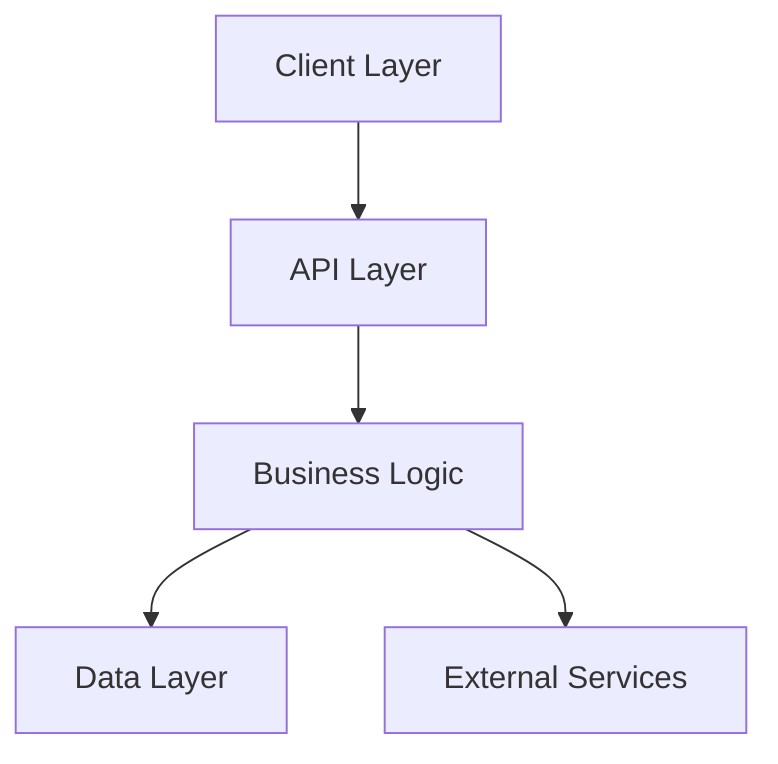

# Architecture

Instructions for maintaining architecture documentation and making architectural decisions.

## Architecture Documentation

When asked about architecture or to create architecture documentation:

1. **Focus on high-level diagrams** using mermaid syntax
2. **Create Architecture Decision Records (ADRs)** for significant decisions
3. **Avoid documenting trivial details** like folder structure or file organization
4. **Keep documentation in sync** with actual implementation

## Creating Architecture Diagrams

When creating system overview diagrams:



Use appropriate diagram types:
- **System Overview**: graph TB (top-bottom flow)
- **Sequence Diagrams**: For workflows and data flow
- **Service Boundaries**: graph LR with subgraphs
- **Deployment**: Show different environments/stages

## Architecture Decision Records (ADRs)

When making or documenting architectural decisions, use this format:

```markdown
### ADR-XXX: [Decision Title]
**Date**: YYYY-MM-DD  
**Status**: Proposed | Accepted | Deprecated | Superseded

**Context**: What is the issue that we're seeing that is motivating this decision?

**Decision**: What is the change that we're proposing and/or doing?

**Consequences**: 
- ✅ Positive consequences
- ❌ Negative consequences or trade-offs
```

## When to Create ADRs

Create an ADR when:
- Choosing primary database technology
- Selecting deployment architecture (serverless vs containers)
- Deciding on authentication approach
- Choosing between monorepo vs multi-repo
- Selecting major frameworks or libraries
- Making security architecture decisions
- Choosing API design patterns (REST vs GraphQL)

## When NOT to Create ADRs

Don't create ADRs for:
- Minor library choices
- Code formatting decisions
- Folder structure
- Variable naming conventions
- Small implementation details

## Maintaining Architecture Docs

When updating architecture:

1. **Check if an ADR exists** for the area being changed
2. **Create a new ADR** if making a significant change
3. **Update diagrams** if system boundaries change
4. **Mark old ADRs as superseded** rather than deleting them

## Architecture Review

When asked to review architecture:

1. **Identify missing ADRs** for significant decisions already made
2. **Check if diagrams match** current implementation
3. **Look for undocumented integrations** with external services
4. **Verify deployment architecture** matches reality

## Common Architecture Patterns

Be familiar with these patterns but don't prescribe them:

- **Layered Architecture**: UI → API → Business → Data
- **Event-Driven**: Services communicate via events
- **Microservices**: Independent deployable services
- **Serverless**: FaaS with managed services
- **Monolithic**: Single deployable unit

## Architecture Documentation Location

Suggest creating these files:
- `docs/architecture/README.md` - Overview and diagrams
- `docs/architecture/decisions/` - Individual ADR files
- `docs/architecture/diagrams/` - Source files for diagrams

## Example Responses

When asked "What's our architecture?":
```
"I'll create a high-level architecture diagram and document the key decisions. 
First, let me understand the current implementation by examining the codebase..."
```

When asked "Should we use microservices?":
```
"Let me create an ADR to document this decision. First, I need to understand:
- Current deployment complexity
- Team size and expertise  
- Scaling requirements
- Development velocity needs"
```

## Key Principles

1. **Document reality, not aspirations**
2. **Focus on decisions that matter**
3. **Use diagrams for clarity**
4. **Keep ADRs concise and focused**
5. **Don't over-architect or over-document**

Remember: Architecture documentation should help developers understand the "why" behind major system design choices, not describe every implementation detail.